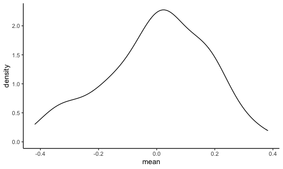
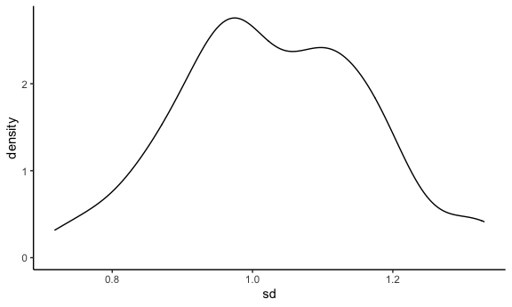
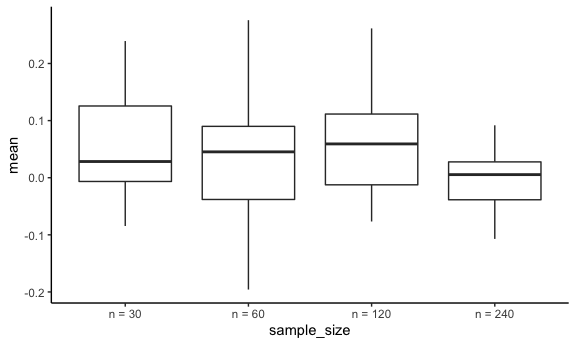

Simulation
================

## Let’s simulate something

I have a function.

``` r
sim_mean_sd = function(sample_size, mu = 0, sigma = 1) { 
  
  sim_data = 
    tibble(
      x = rnorm(n = sample_size, mean = mu, sd = sigma)
    )
  
  sim_data %>% 
    summarize(
      mean = mean(x),
      sd = sd(x)
    )
}
```

I can “simulate” by this line.

``` r
sim_mean_sd(300)
```

    ## # A tibble: 1 × 2
    ##     mean    sd
    ##    <dbl> <dbl>
    ## 1 0.0336 0.964

## Let’s simulate a lot.

let’s start with a for loop.

``` r
output = vector("list", 10)

for (i in 1:10) {
  
  output[[i]] = sim_mean_sd(100)
  
}

bind_rows(output)
```

    ## # A tibble: 10 × 2
    ##         mean    sd
    ##        <dbl> <dbl>
    ##  1  0.0516   0.992
    ##  2 -0.0391   1.17 
    ##  3 -0.0445   0.966
    ##  4 -0.200    1.08 
    ##  5  0.000255 1.10 
    ##  6  0.0101   1.09 
    ##  7  0.00407  1.05 
    ##  8 -0.0103   1.03 
    ##  9 -0.152    0.986
    ## 10  0.243    1.08

Let’s use a loop function.

``` r
sim_results = 
  rerun(100, sim_mean_sd(30)) %>% 
  bind_rows
```

Let’s look at results…

``` r
sim_results %>% 
  ggplot(aes(x = mean)) + geom_density()
```



``` r
sim_results %>% 
  summarize(
    avg_samp_mean = mean(mean),
    sd_samp_mean = sd(mean)
  )
```

    ## # A tibble: 1 × 2
    ##   avg_samp_mean sd_samp_mean
    ##           <dbl>        <dbl>
    ## 1      -0.00102        0.177

``` r
sim_results %>% 
  ggplot(aes(x = sd)) + geom_density()
```



## rerun

``` r
n_list = 
  list(
    "n = 30" = 30,
    "n = 60" = 60,
    "n = 120" = 120,
    "n = 240" = 240
  )

output = vector('list', 4)

output[[1]] = rerun(100, sim_mean_sd(sample_size = n_list[[1]])) %>%  bind_rows

for (i in 1:4) {
  
  output[[i]] = 
    rerun(100, sim_mean_sd(sample_size = n_list[[1]])) %>% 
    bind_rows()
}
```

``` r
sim_results =
  tibble(
    sample_size = c(30, 60, 120, 240)
  ) %>% 
    mutate(
      output_lists = map(.x = sample_size, ~ rerun(10, sim_mean_sd(.x))),
      estimate_df = map(output_lists, bind_rows)
    ) %>% 
    select(-output_lists) %>% 
    unnest(estimate_df)
```

Let’s do some data frame things.

``` r
sim_results %>% 
  mutate(
    sample_size = str_c('n = ', sample_size),
    sample_size = fct_inorder(sample_size)
  ) %>% 
  ggplot(aes(x = sample_size, y = mean)) +
  geom_boxplot()
```


